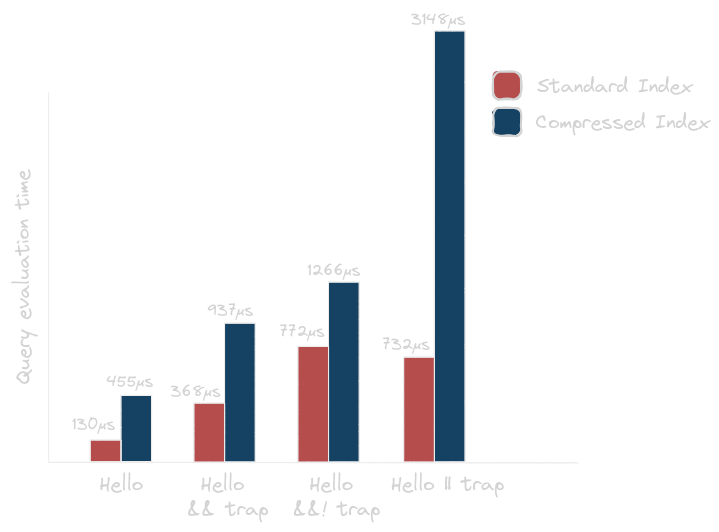
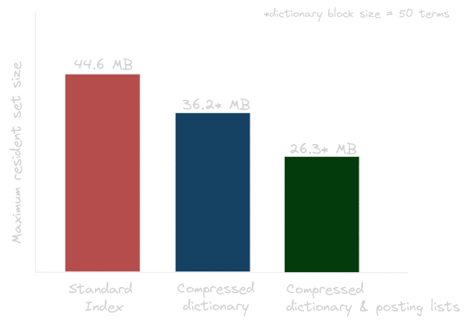

# IR Information Retrieval System Project

This project is a boolean information retrieval system that uses compressed dictionaries and posting lists. It includes front-end coding for dictionary compression and variable byte code for the posting list, utilizing SPIMI single pass in memory indexing for index construction. The project allows you to build two types of indexes: one standard and another with compressed components.

## Table of Contents
- [IR Information Retrieval System Project](#ir-information-retrieval-system-project)
  - [Table of Contents](#table-of-contents)
  - [Requirements ](#requirements-)
  - [Compilation ](#compilation-)
  - [Running the Code ](#running-the-code-)
  - [Queries ](#queries-)
  - [Query Evaluation Duration ](#query-evaluation-duration-)
  - [Memory Usage ](#memory-usage-)

## Requirements <a name="requirements"></a>
To compile and run the project, ensure you have:
1. g++ installed on your system.
2. The source files in a directory with the Makefile.

## Compilation <a name="compilation"></a>
Use the following command to compile the code:
```bash
make
```
By default, it will compile the compressed index version of the boolean IR system. If you want to build the standard boolean index instead, open `Index.h` and comment out the line with #define COMPRESS before running make.

## Running the Code <a name="running-the-code"></a>
To run the compiled code and measure memory usage, use:
```bash
/usr/bin/time -v ./output/main
```
Queries are expected in a specific format as described below. The system will print the query evaluation duration before showing the results of each query.

## Queries <a name="queries"></a>
Queries should be formatted using the following operators:
- `&&` for AND
- `||` for OR
- `&&!` for AND NOT

For example, a valid query would look like this:
```plaintext
term1 && term2 || term3 &&! term4 ...
```
## Query Evaluation Duration <a name="query-evaluation-duration"></a>
Just before the results of a query are displayed, the system will print the duration taken to evaluate that particular query. This helps you understand how long it takes for the IR system to process and return the given query's results.  



## Memory Usage <a name="memory-usage"></a>
To monitor memory usage while running the program, use the `/usr/bin/time -v` command as mentioned in [Running the Code](#running-the-code). It will provide you with information about maximum resident set size (maximum memory used) during the execution of the code.  

